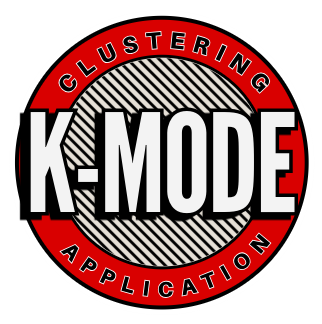

  

<h1 align="center">Kmodes clustering application</h1>

  <em>Python script to apply K-modes on categorical dataset derived from knowledge graph.</em>

  <a href="https://shakirasa.github.io/Kmodes_clustering_application-for-knowledge-graphs/" target="_blank">🌐 Live Demo</a> |
  <a href="mailto:s.agata@student.maastrichtuniversity.nl">✉️ Contact</a>

  
  

<h2>Background</h2>

This repository contains the script and output for the application of the K-modes clustering model on a categorical dataset to identify patterns present. The script and output is released under the MIT license.

